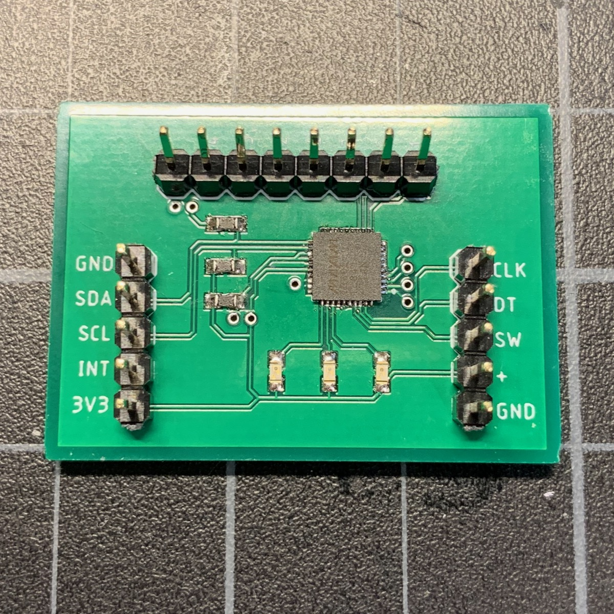
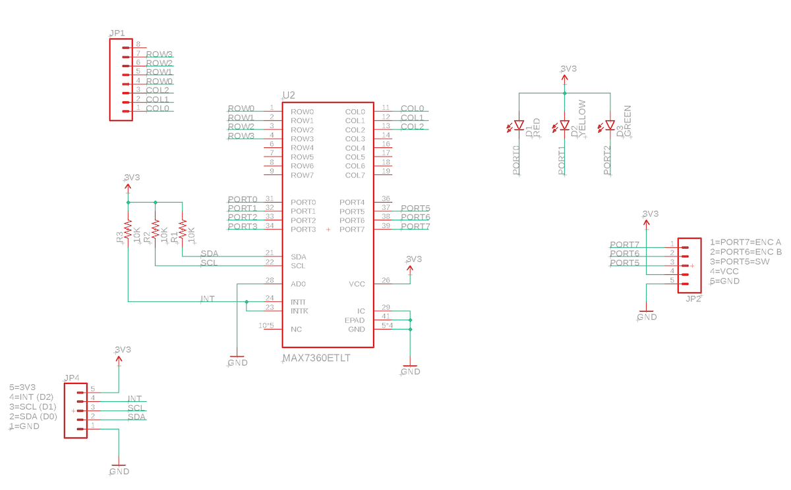
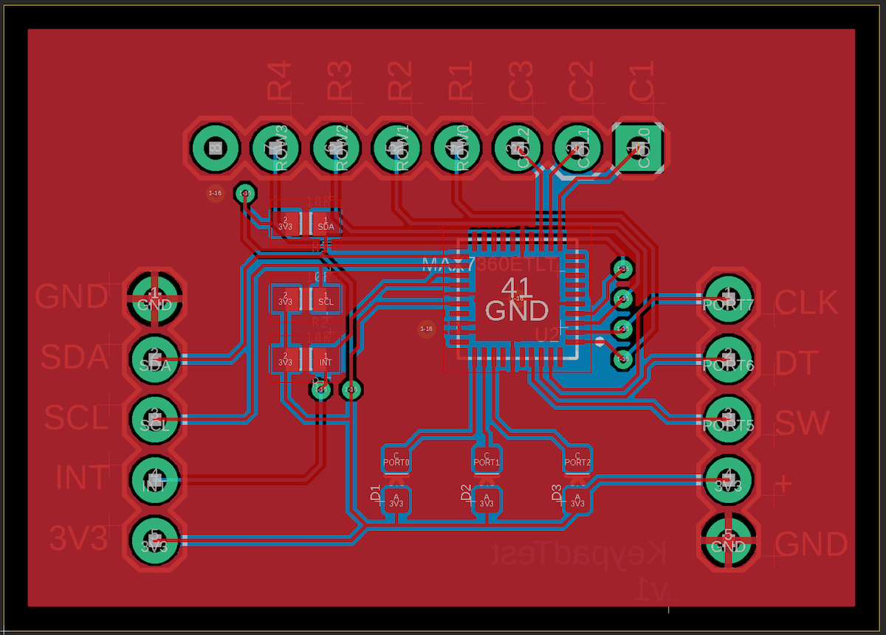
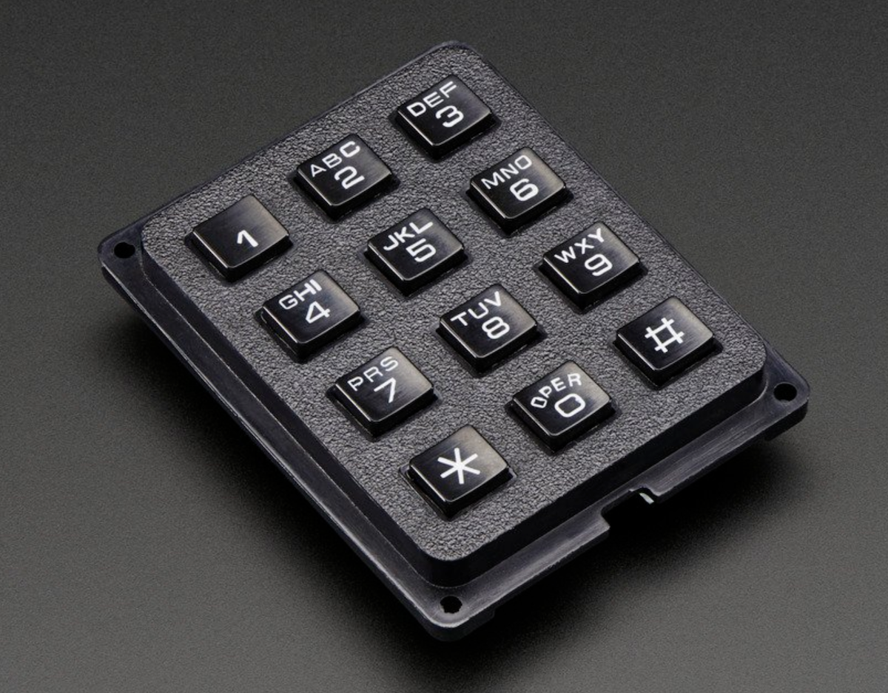

# MAX7360-RK

*MAX7360 I2C Keypad, LED, and GPIO for Particle devices*

## Introduction

The [MAX7360](https://www.digikey.com/product-detail/en/maxim-integrated/MAX7360ETL-T/MAX7360ETL-TCT-ND/9760168) is a super-useful keypad, GPIO expander, and LED driver with an I2C interface. The chip is tiny (40TQFN) and a bit expensive ($5.22), but it can do a lot:

- Support for passive matrix keypads up to 8x8. It's perfect for 3x4 phone-style keypads and 4x4 small keypads.
- Built-in debounce (with programmable delay) and FIFO queue for keypad press and release.
- 8 GPIO pins with PWM support.
- Built-in constant-current driver so you don't need current-limiting resistors for LEDs.
- Additional open-drain output ports if you're not using all of the columns.
- Built-in support for LED blink and fade in or out.
- Individual PWM control for up to 8 LEDs.
- Rotary encoder support.
- Debounce support for switches attached to GPIO with programmable delay.
- I2C interface. Addressing support for up to 4 MAX7360 on a single I2C bus.

## The library

Information to be added later.

## KeypadTest Board

I made a simple demo board to test and illustrate the use of the chip. 

Here's the schematic.

And the board layout.

The eagle subdirectory contains the open source design:

- KeypadTest.sch (schematic)
- KeypadTest.brd (board layout)
- KeypadTestv1.zip (gerbers)

### BoM (Bill of Materials)

| Quantity | Item | Example | Price |
| --- | --- | --- | ---: |
| 1 | MAX7360 IC CTRLR KEY-SW I2C 40TQFN | [MAX7360ETL-T](https://www.digikey.com/product-detail/en/maxim-integrated/MAX7360ETL-T/MAX7360ETL-TCT-ND/9760168) | $5.22 |
| 1 | Red LED 5mA 0603 | [Lite-On LTST-C193KRKT-5A](https://www.digikey.com/product-detail/en/lite-on-inc/LTST-C193KRKT-5A/160-1830-1-ND/2356251) | $0.41 |
| 1 | Yellow LED 5mA 0603 | [Lite-On LTST-C193KSKT-5A](https://www.digikey.com/product-detail/en/lite-on-inc/LTST-C193KSKT-5A/160-1831-1-ND/2356253) | $0.41 |
| 1 | Green LED 5mA 0603 | [Lite-On LTST-C193KGKT-5A](https://www.digikey.com/product-detail/en/lite-on-inc/LTST-C193KGKT-5A/160-1828-1-ND/2356247) | $0.41 |
| 3 | 10K Resistor 0603 | [Panasonic ERJ-PA3J103V](https://www.digikey.com/product-detail/en/panasonic-electronic-components/ERJ-PA3J103V/P10KBZCT-ND/5036237) | $0.10 | 
|   | Male header pins 0.1" | [Sullins PRPC040SAAN-RC](https://www.digikey.com/product-detail/en/PRPC040SAAN-RC/S1011EC-40-ND/2775214) |  |

### Other Accessories

The keypad I tested with is the Adafruit [3x4 Phone Matrix Keypad](https://www.adafruit.com/product/1824).

The rotary encoder I tested with is [this one from Amazon](https://www.amazon.com/Cylewet-Encoder-15%C3%9716-5-Arduino-CYT1062/dp/B06XQTHDRR/ref=sr_1_1_sspa). Even though it's listed as being a 5V device, it works well at 3.3V, which is necessary for this design.

